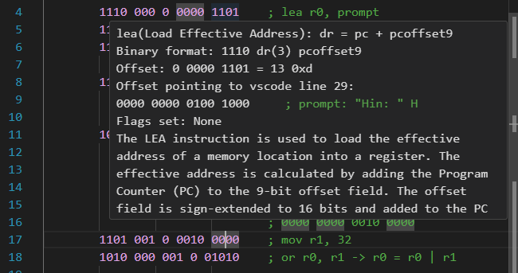

# LCC Tools
The Low Cost Computer is made by Anthony J. Dos Reis for his [textbook](https://www.amazon.com/C-Under-Hood-2nd/dp/B09B74P6C4) C and C++ Under the Hood: 2nd Edition. The LCC Tools is a vscode extension that provides a set of tools to help the user to work with the LCC. 
# Preview

# Supported Files
- **.bin** - Binary files
- more to be added
## Machine Code Features(At the moment)
- **Syntax Highlighting**
- **Hover Information**
- **Calculate pcoffset line number w/ preview**
- **Calculate binary value to decimal & hex**

# Contributing
Feel free to contribute to this project here [On Github](https://github.com/lettucegoblin/vscode-lcc). Also feel free to fork and make your own version of this extension. Have a good day. 